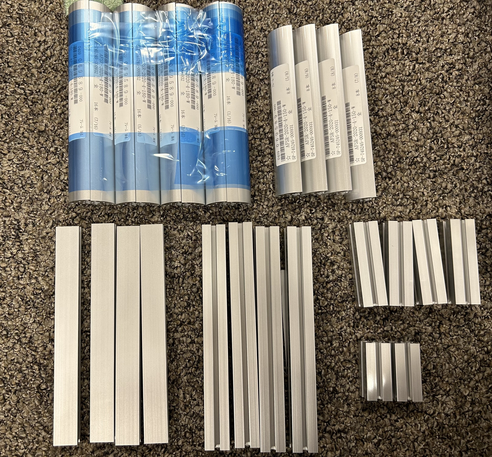
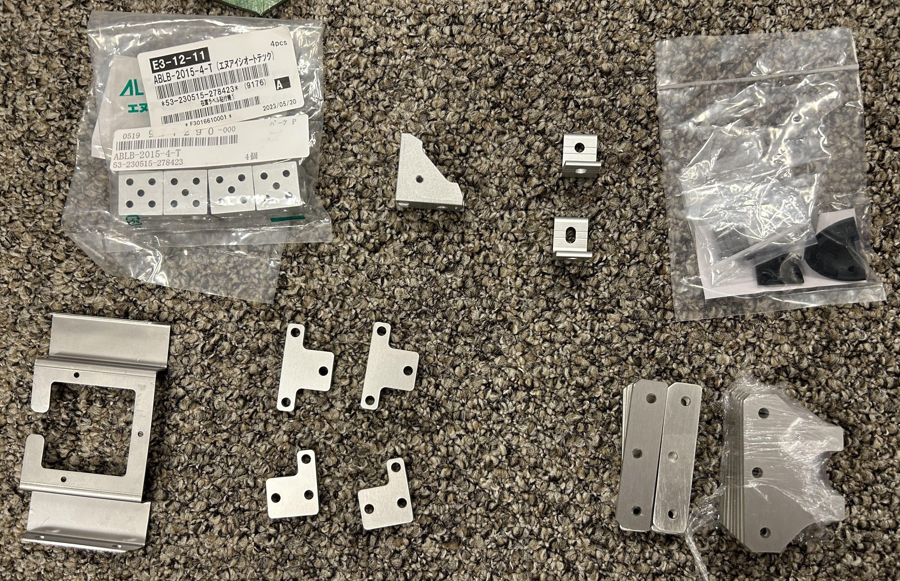
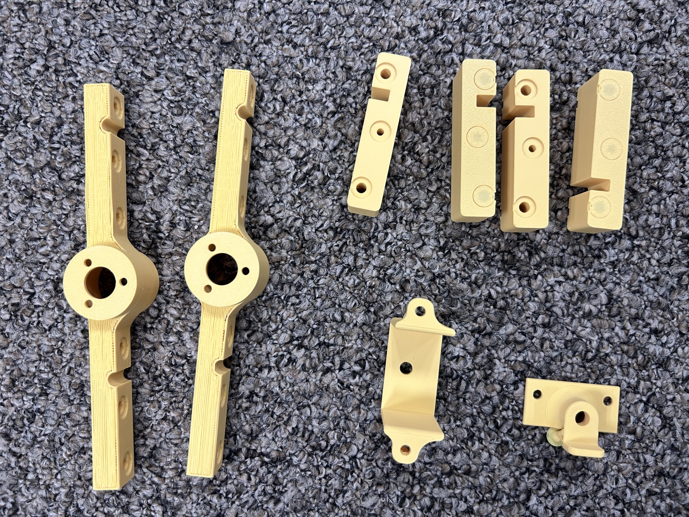
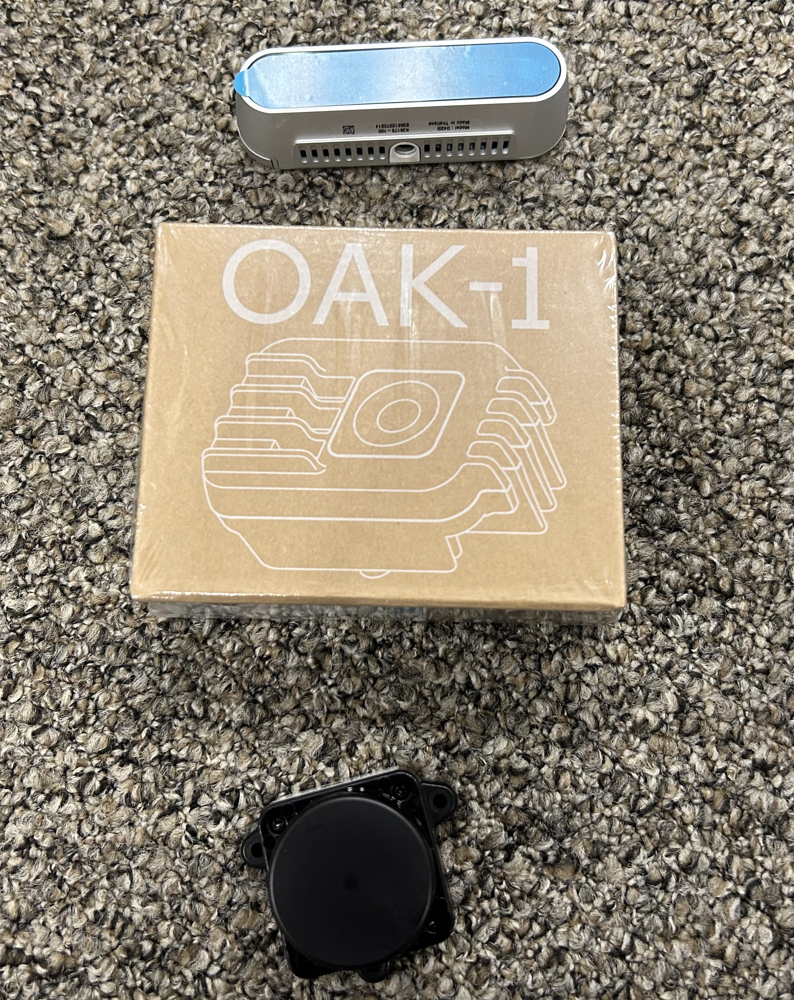
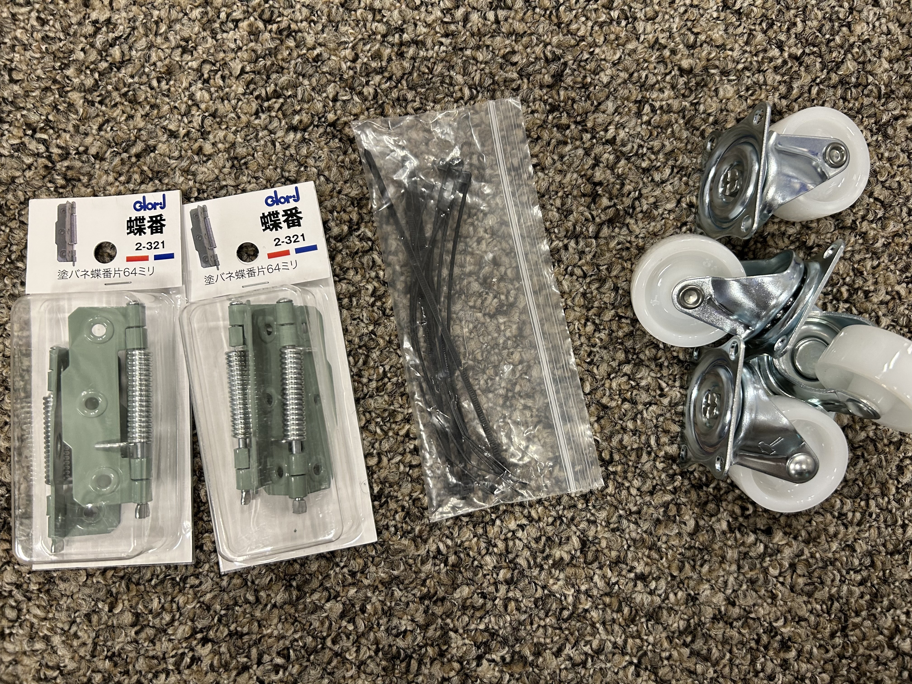
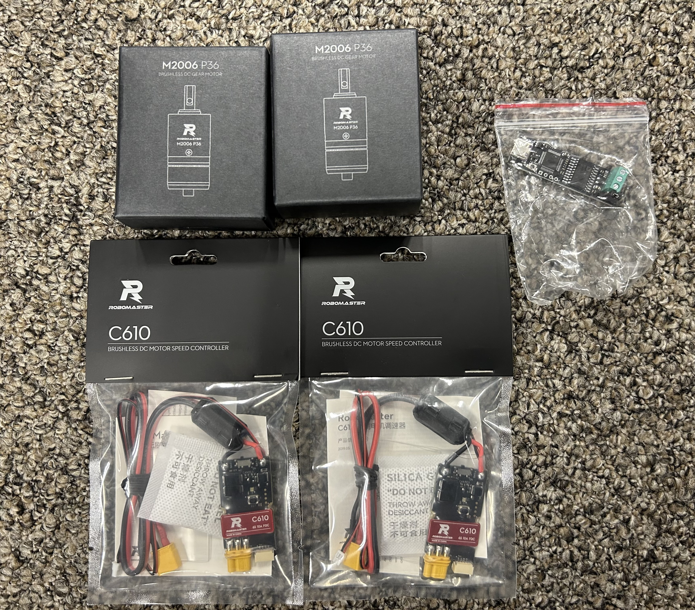
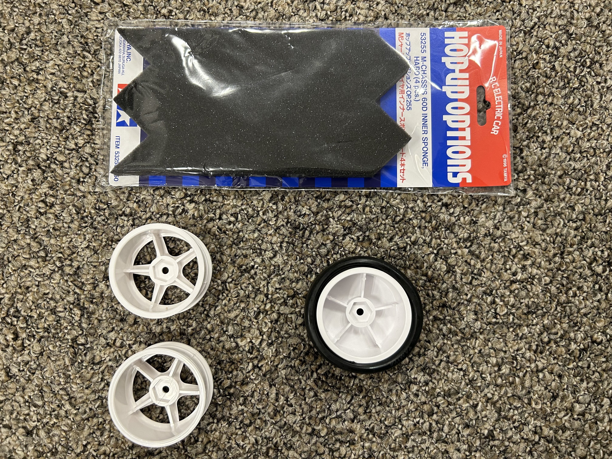
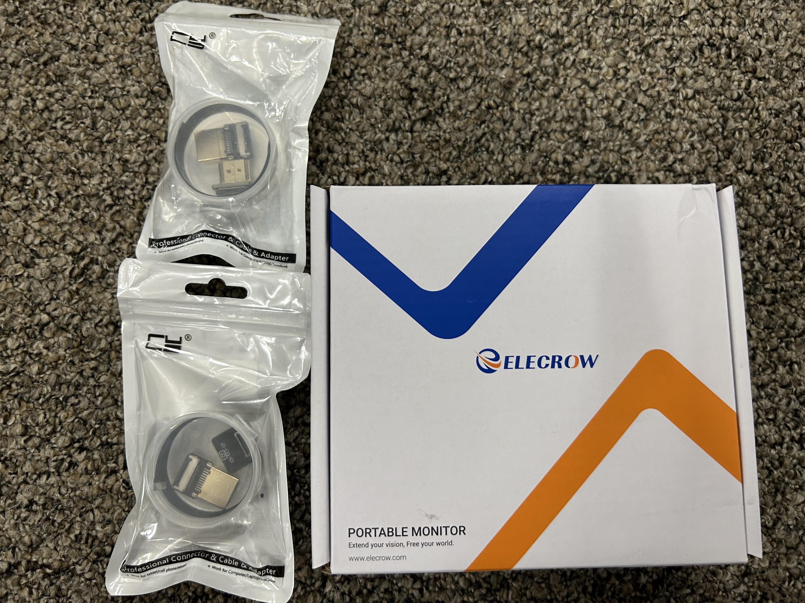
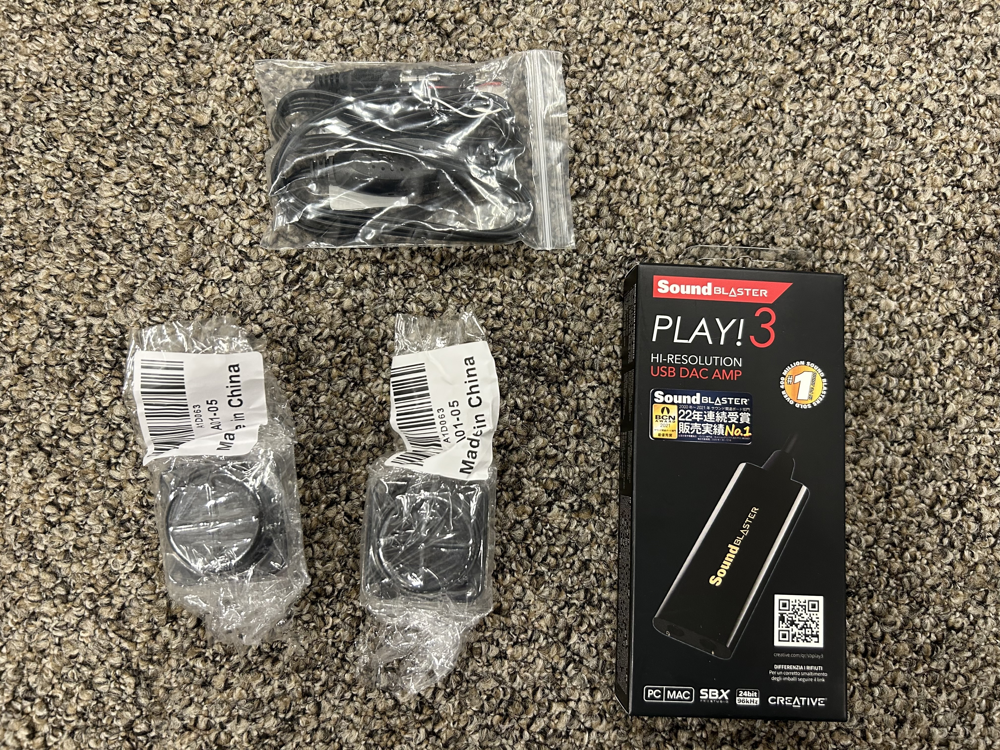

## 部品チェック(Check)
 
購入したもの・発注したものが届いたら必要なものをチェックします。 
組み立てやすくするために部材を分けておくのがおすすめです。

 
---

### アルミフレーム
26本あることを確認します。

| ✅ | 断面の形 | 長さ[mm] | 本数 | 
| --- | --- | --- | --- |
| | R型 | 180  | 8 |
| | R型 | 150 | 4
| | 薄型 | 180 | 4 | 
| | 正方形 | 180 | 4 |
| | 正方形 | 70 | 4 |
|  | 正方形 | 45 | 2 |

左上から

### アルミブラケット類・金属バーツ
以下があることを確認します

| ✅ | 形の説明 | 個数 |
| --- | --- | --- |
| | 顔面用の四角いブラケット | 4 | 
| | 三角のブラケット| 28 | 
| | L字のブラケット| 2 |
| | 角用の丸形ブラケット| 8 | 
| | LiDARマウント用金属パーツ | 1 |
| | 頭取り付け用用金属パーツ(T型) | 2 |
| | 頭取り付け用用金属パーツ(L型) | 2 |
| | 足回り用金属パーツ(小) | 8 | 
| | 足回り用金属パーツ(大) | 8 |

### 3Dプリンタ部品
以下があることを確認します

| ✅ | 説明 | 個数 | 
| --- | --- | --- |
|  | モータ取り付け用パーツ | 2 |
| | 足回り取り付けパーツ | 4 |
| | AIカメラ取り付けパーツ |1|
| | 深度カメラ取り付けパーツ | 1 |

### カメラ・センサ類
以下があることを確認します

| ✅ | 説明 | 個数 | 
| --- | --- | --- |
| | 深度カメラ(Realsense) |1|
| | AIカメラ(OAK-1) | 1 |
|  | LiDAR | 1 |

)

### 足回り部品
以下があることを確認します

| ✅ | 説明 | 個数 | 
| --- | --- | --- |
| | バネ蝶番 |4 |
| | インシュロック | 4 | 
| | キャスタ |4 |
| | モータ(M2006 P36) | 2 |
|  | モータコントローラ(C610) | 2 |
| | USBtoCAN(CANablePro) |1 |
| | ホイールインナー |2 |
| | ホイール |2 |
| | タイヤ |2 |
| | アイソレータ |1 |

[TODO] アイソレータ・ホイールが来たら写真を更新する

### アクリル板
写真のように8枚があることを確認します

### ディスプレイ関連
写真のようにあることを確認します

| ✅ | 説明 | 個数 | 
| --- | --- | --- |
| | HDMIリボンケーブル1 | 1 |
| | HDMIリボンケーブル2 | 1 |
|  | ディスプレイ(ELECROW) | 1 |

### USBケーブル・ハブ
写真のようにあることを確認します

| ✅ | 説明 | 個数 | 
| --- | --- | --- |
|  | A-A | | 
|  | A-microB | 2 |
|  | A-C | |
|  | バッファローのUSBハブ4Port |1|
|  | ELECOMのUSBハブ4Port | 2 |

### スピーカ・マイク
写真のようにあることを確認します

| ✅ | 説明 | 個数 | 
| --- | --- | --- |
|  | スピーカアンプ | 1 |
|  | スピーカ| 2 | 
|  | USB(Sound Braster!) | 1 |
|  | マイク | 1 |

[TODO] マイクの写真を追加

### PC・バッテリ関連
写真のようにあることを確認します

| ✅ | 説明 | 個数 | 
| --- | --- | --- |
|  | PC| 1 | 
|  | モバイルバッテリ | 1 |
|  | PC-モバイルバッテリのケーブル | 1 |

### ねじ・ナット
写真のようにあることを確認します

銀色のネジ

黒色のネジ

ナットM3

ナットM4

ナットホルダー

### 熱収縮チューブ
写真のようにあることを確認します

### コネクタ
写真のようにあることを確認します

### ケーブル
写真のようにあることを確認します

---
[前のページ](./1_order.md) | [indexに戻る](../index.md) | [次のページ](../2_assemble/2_assemble.md)
