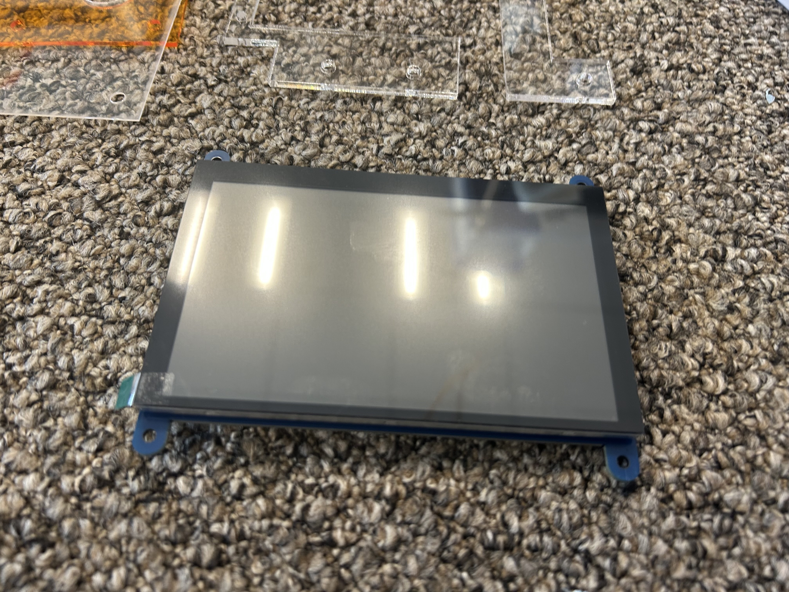
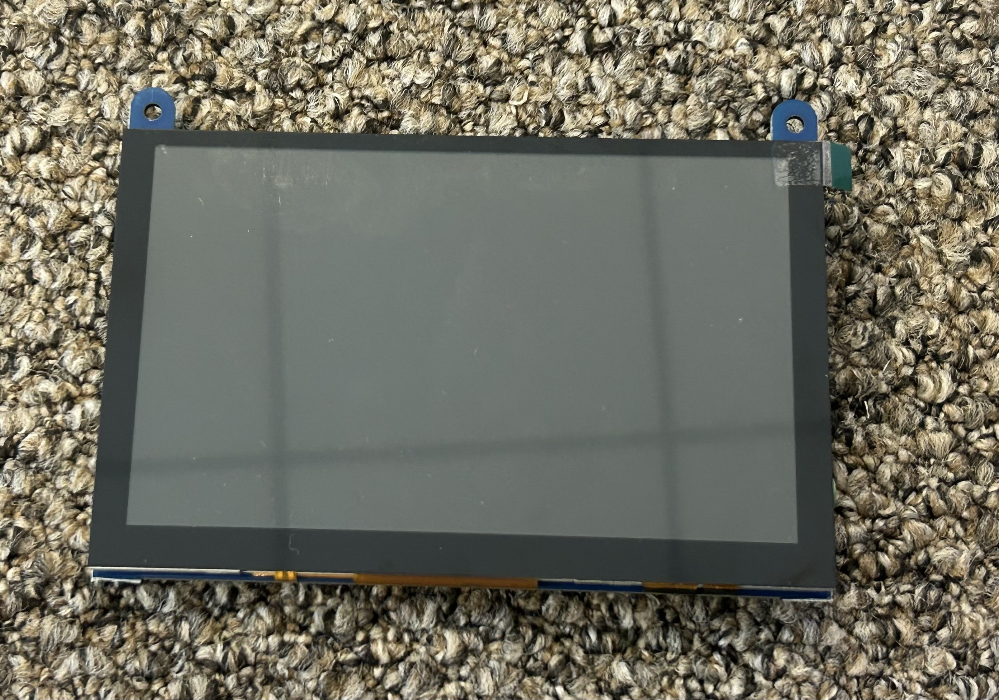
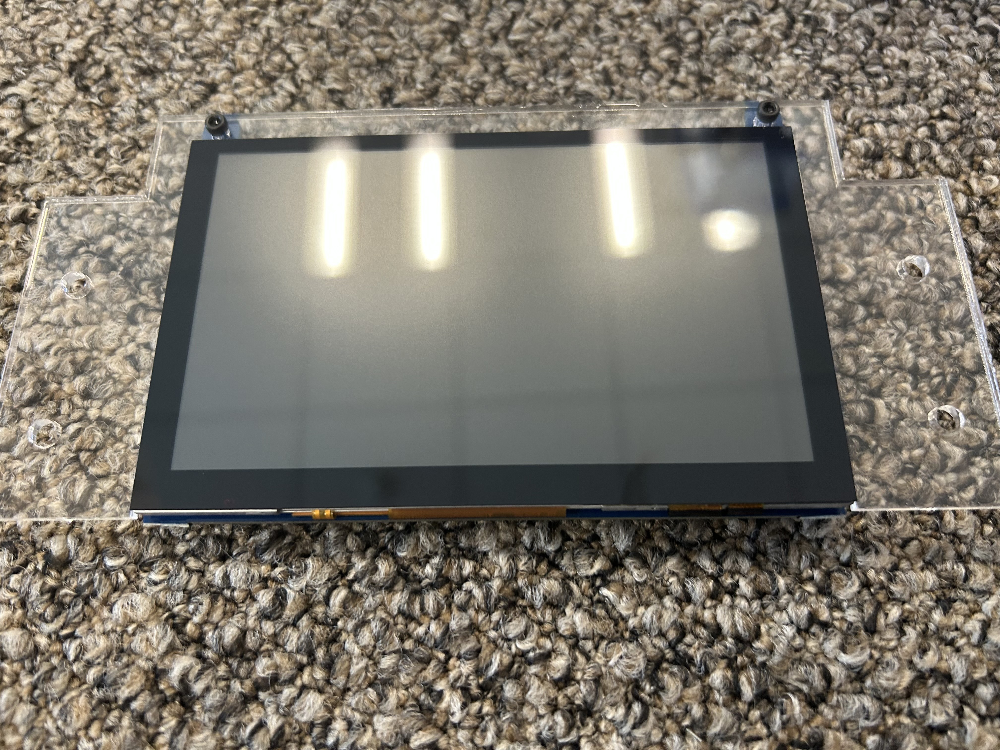
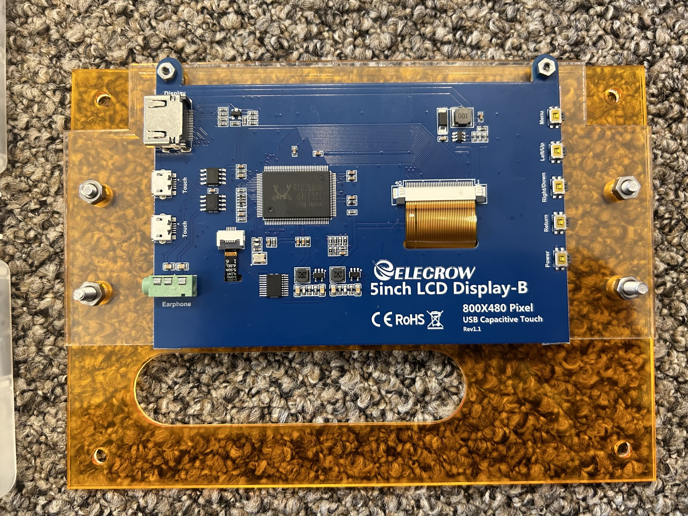
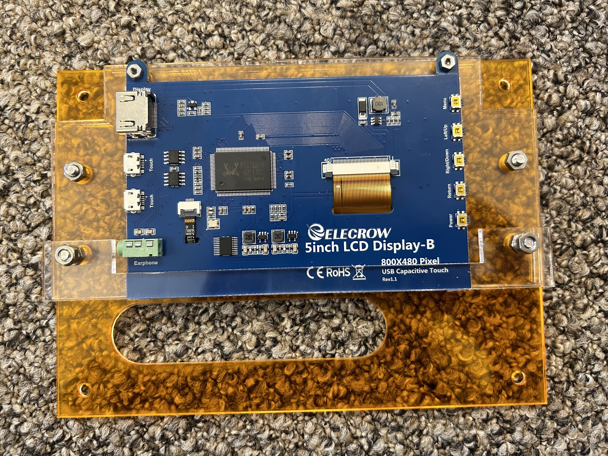
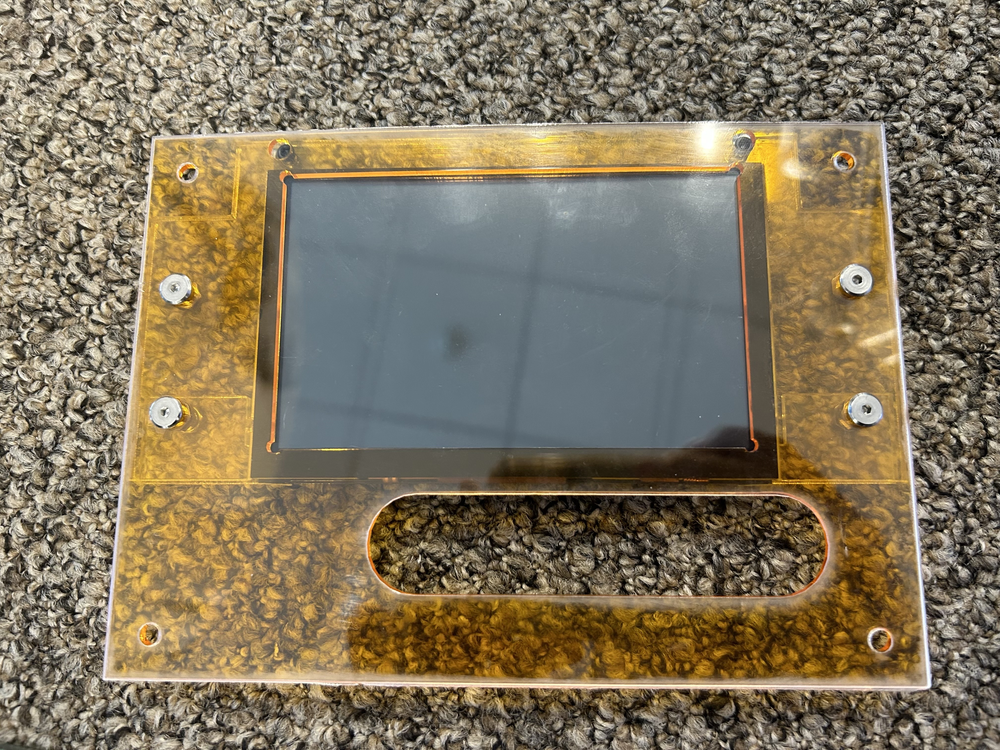

## 顔の組み立て
 
ディスプレイをアクリル板にはめて顔を組み立てます。
 

---
## 工具

- ニッパー
- 六角レンチ

## 必要な部品

- ネジ
    - M4(SSHS)
        - 10[mm] (2本)
        - 16[mm] (2本)
    - M2.5(黒)
        - 6[mm] (2本)　
- ナット
    - M4(6個)
    - M2.5(2個)
- アクリル板
    - face1 透明1mm (1枚)
    - face2 カラー2mm (1枚)
    - display1 透明3mm (1枚)
    - displau2 透明3mm (1枚)

## 手順①ディスプレイの取り付け
ディスプレイの下2つのタブをニッパーでカットする

透明のアクリルをはさんでM2.5のねじ2つでとめる

裏返して、下から透明1[mm]の板、色付きの板、ディスプレイと重ねる 
上から2番目の左右の穴にM4の10[mm]のねじ、その下に16[mm]のねじをナットで止める 

さらに透明の長細い板を取り付けて下にナットで止める

表に返して完成

---
[indexに戻る](../index.md)
|[assenbleに戻る](../2_assemble.md)
|[次のページ](./2-2.%20almi_frame.md)
