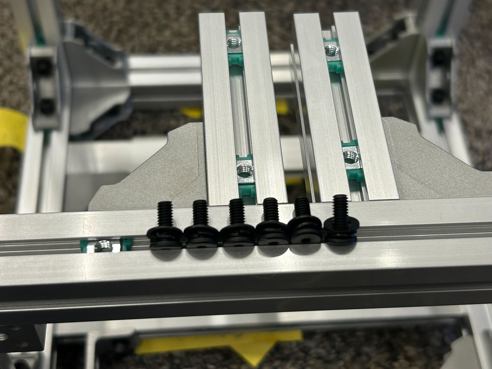
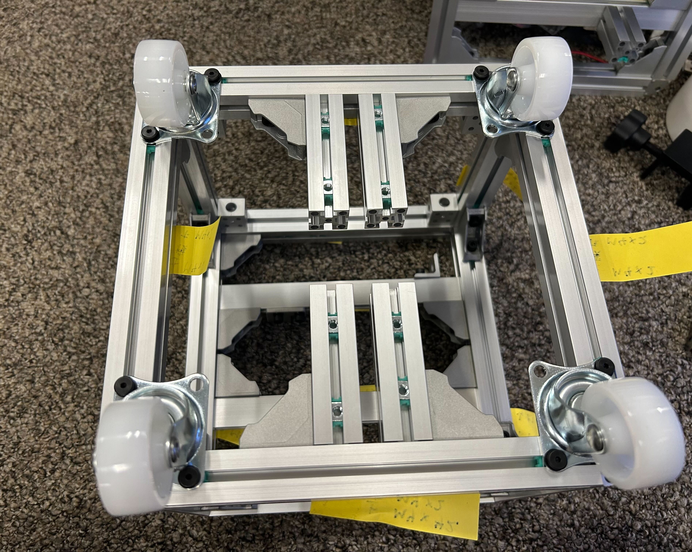

## キャスターの取り付け

キャスターを取り付けます

---

## 必要な工具

- 六角レンチ

---

## 部材

- キャスター4個
- ネジ
    - M4(黒、極低頭、滑り止め付き)
        - 10[mm]　(12個)
- M4ワッシャー(12個)
- M4スプリングワッシャー(12個)

---

## 手順①取り付け
低頭ねじにスプリングワッシャー・ワッシャーの順でとりつけます

キャスターの向きに注意して、3点ずつ止めます

---
[indexに戻る](../index.md)
|[assenbleに戻る](../2_assemble.md)
|[次のページ](./2-4.sensor.md)
