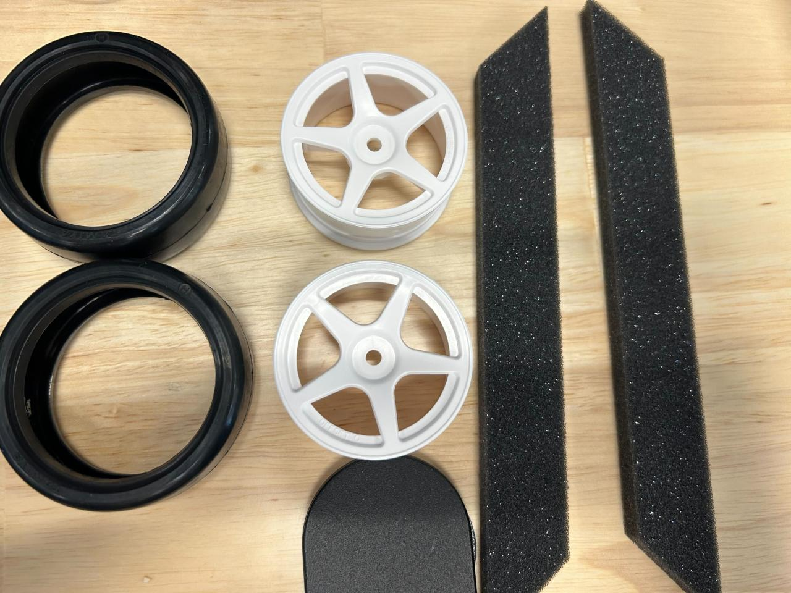
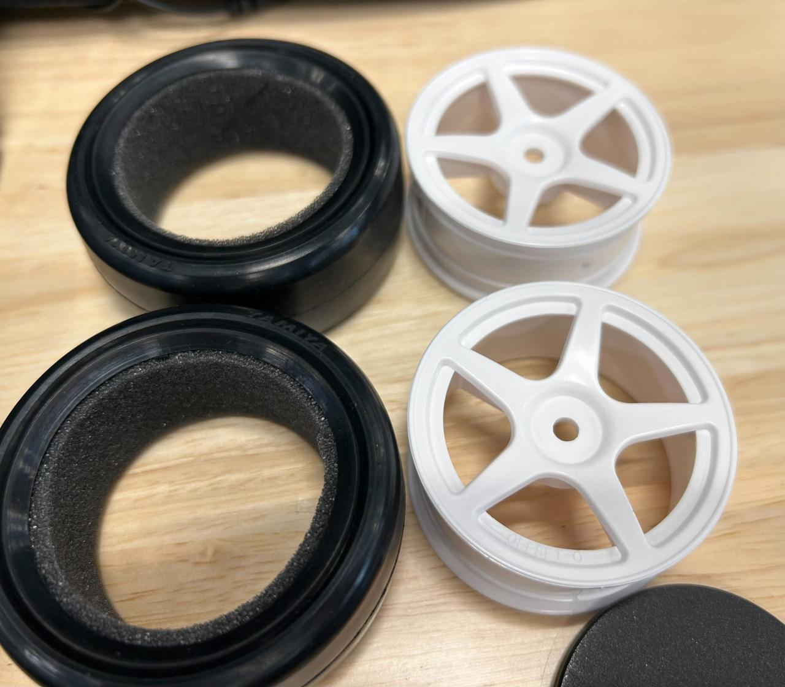
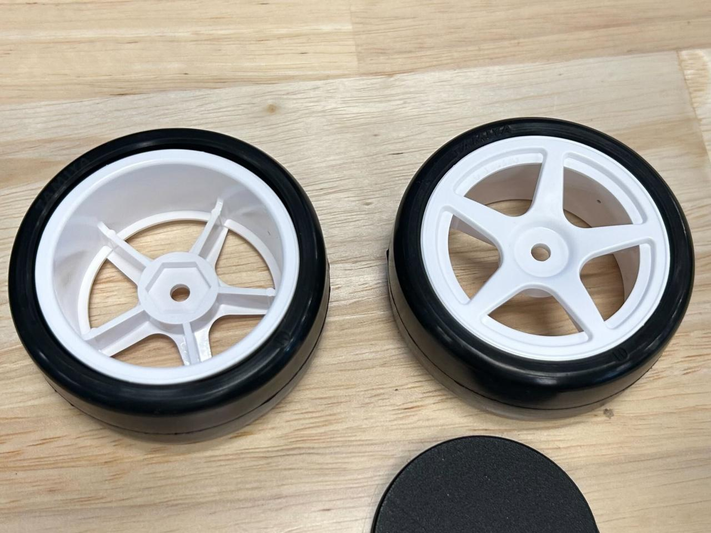

## タイヤの制作

タイヤを制作します

---

## 必要な工具

- 瞬間接着剤
---
## 部材

- ホイール(2個)
- タイヤ(2個)
- インナースポンジ((2個))

---

## 手順①タイヤにインナースポンジをはめる

## 手順②タイヤにホイールをはめる

## 手順③瞬間接着剤を流す

完成

---
[indexに戻る](../index.md)
|[assenbleに戻る](../2_assemble.md)
|[次のページ](./2-2.%20almi_frame.md)
