## センサーの取り付け

センサーを取り付けます

---

## 必要な工具

- 六角レンチ
- ヒートガン

---

## 部材
※AIカメラと深度カメラはM6ではなく本来1/4インチネジですが 
　M6でぎりぎり入るのでそうしてます。 

- LiDAR
- LiDAR取り付け用金属部材
- AIカメラ
- AIカメラ取り付け用3Dプリント部品
- RealsenseD435
- Realsense取り付け用3Dプリント部品
- 透明の熱収縮チューブ(Φ21) 40[mm]

- ネジ
　　- M2.5
        - 六角穴 / 黒 / 5[mm] (3本)
    - M4
        - 六角穴 / 黒 / 10[mm] (8本)
    - M6( or 1/4inchねじ)
        - 六角穴 / ステンレス /　8[mm] (1本):深度カメラ用
        - 六角穴 / 黒 /　5[mm] (1本):AIカメラ用
- ナット
    - M2.5(3個)

---

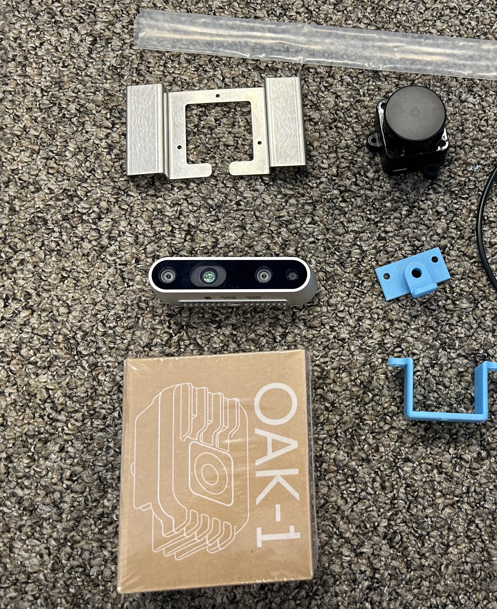
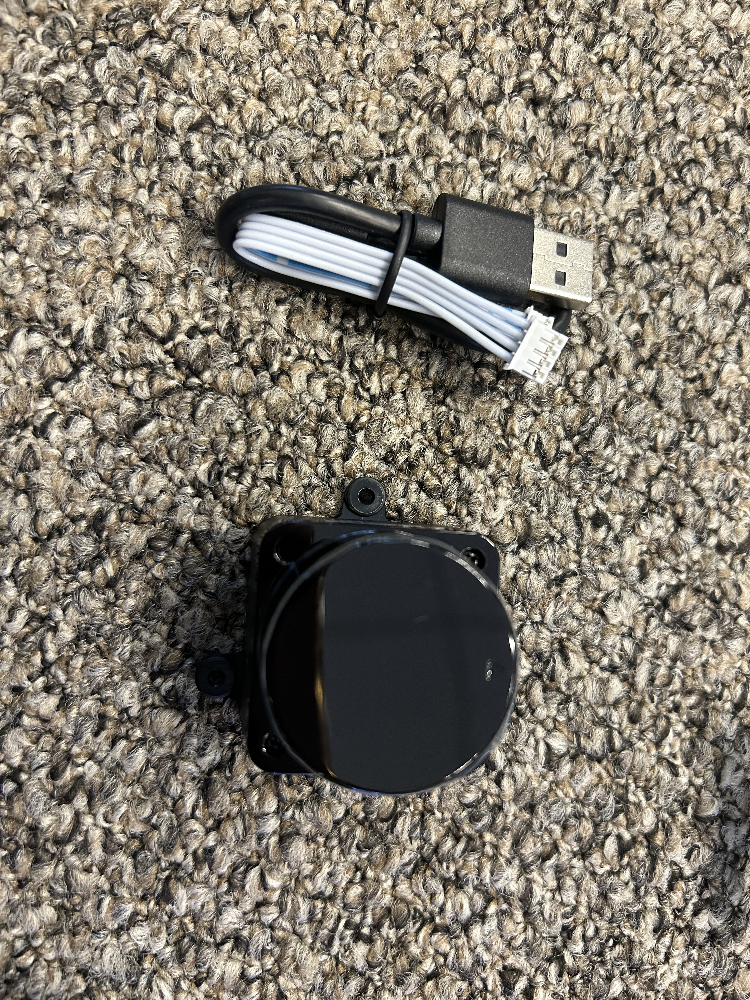

## 手順①取り付けパーツをつける
深度カメラに3Dパーツを下からM6のステンレスネジでつける 
AIカメラに3DパーツをM6の黒ネジでつける
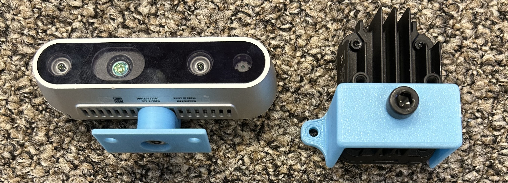
LiDARはM2.5ねじ3個とナットで図のようにつける
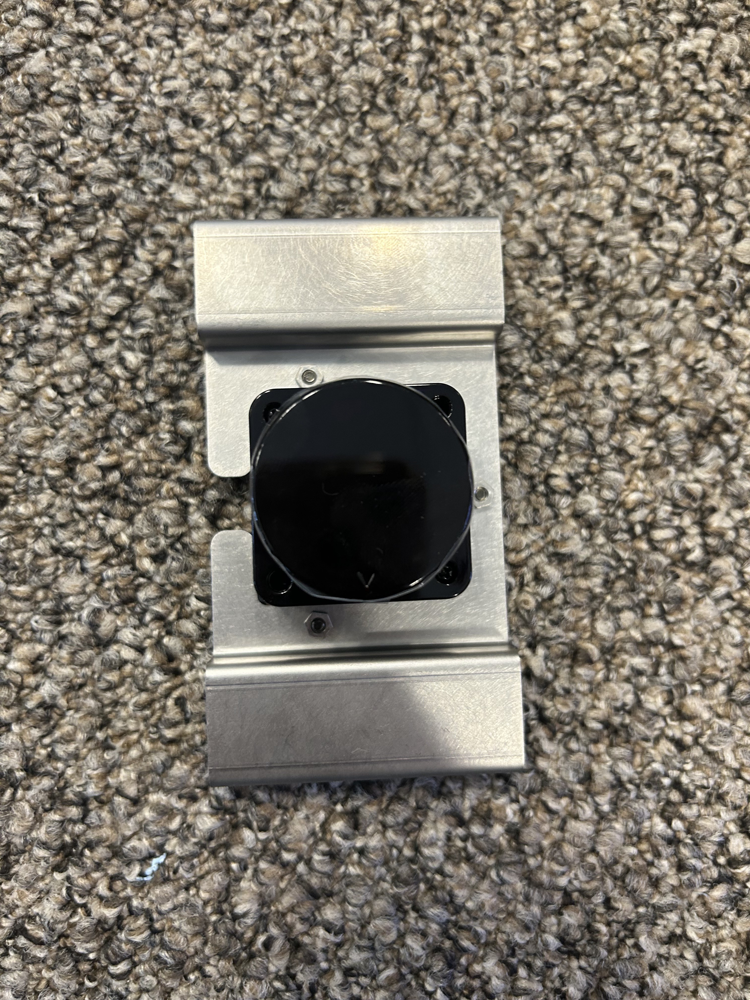
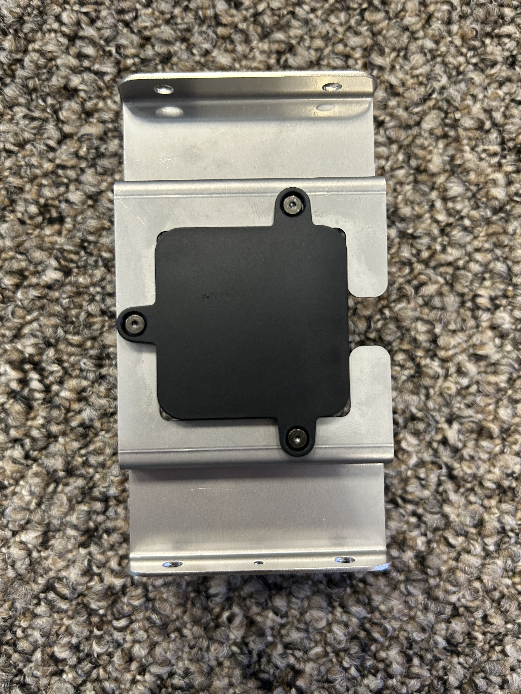

## 手順②本体への取り付け
前面に深度カメラ、上部にLiDAR、前面にAIカメラの順でとりつける
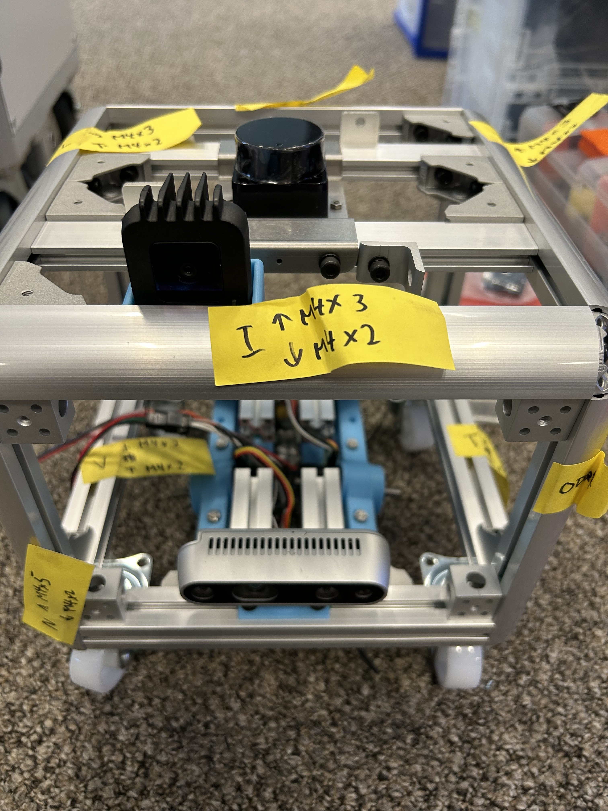
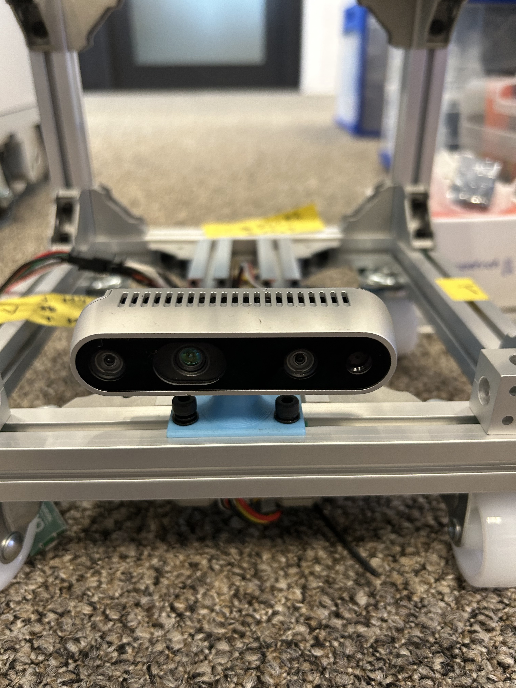
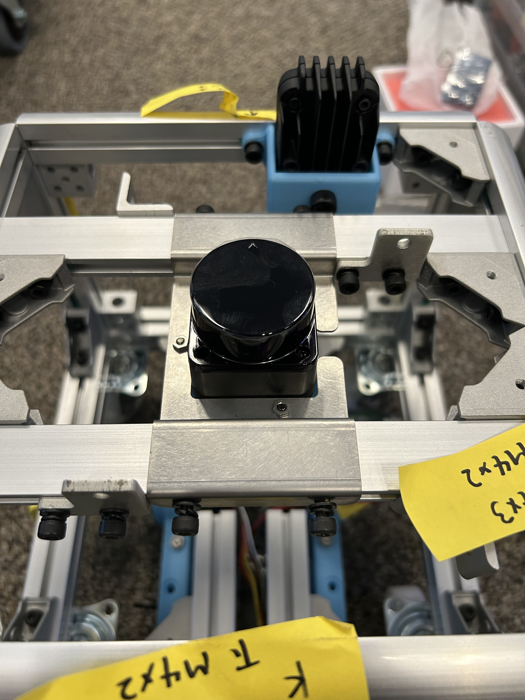
LiDARは小さな丸がついている方が前面で真ん中
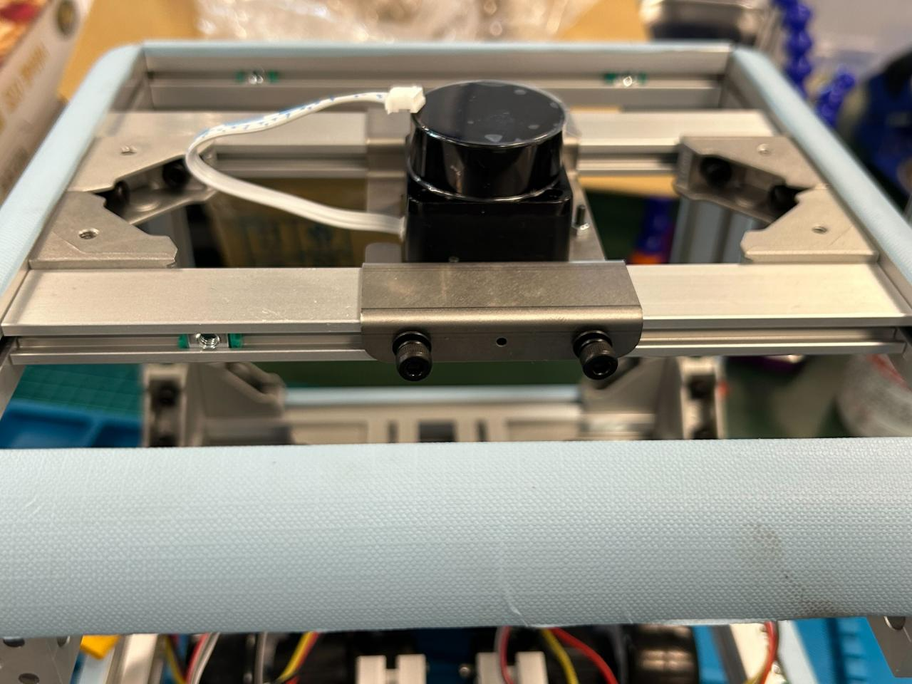

## 手順③LiDAR基板の熱収縮
40[mm]にカットした熱収縮チューブを取り付けて熱収縮する
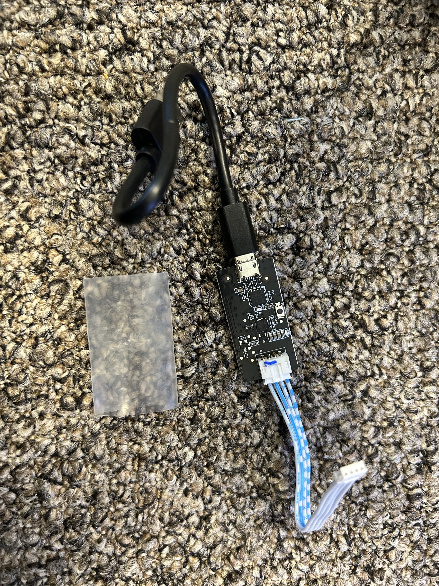
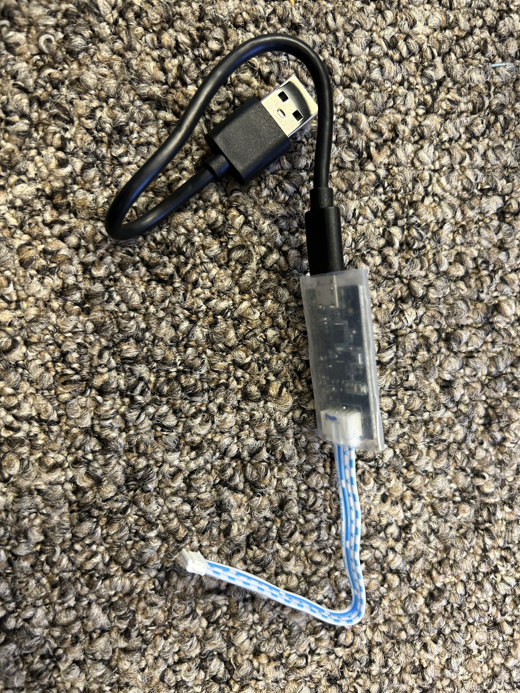

---
[indexに戻る](../index.md)
|[assenbleに戻る](../2_assemble.md)
|[次のページ](./2-2.%20almi_frame.md)
