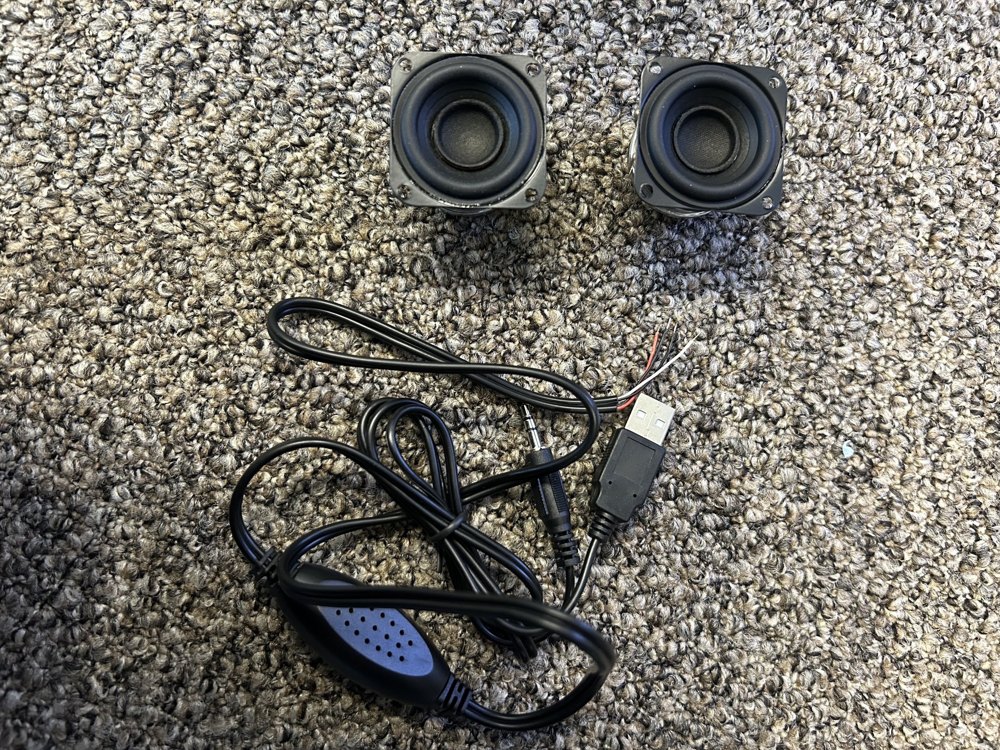
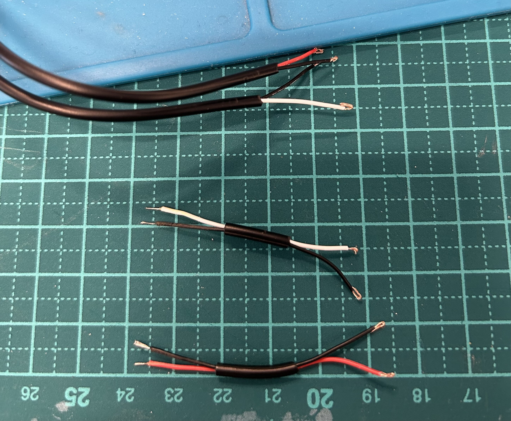
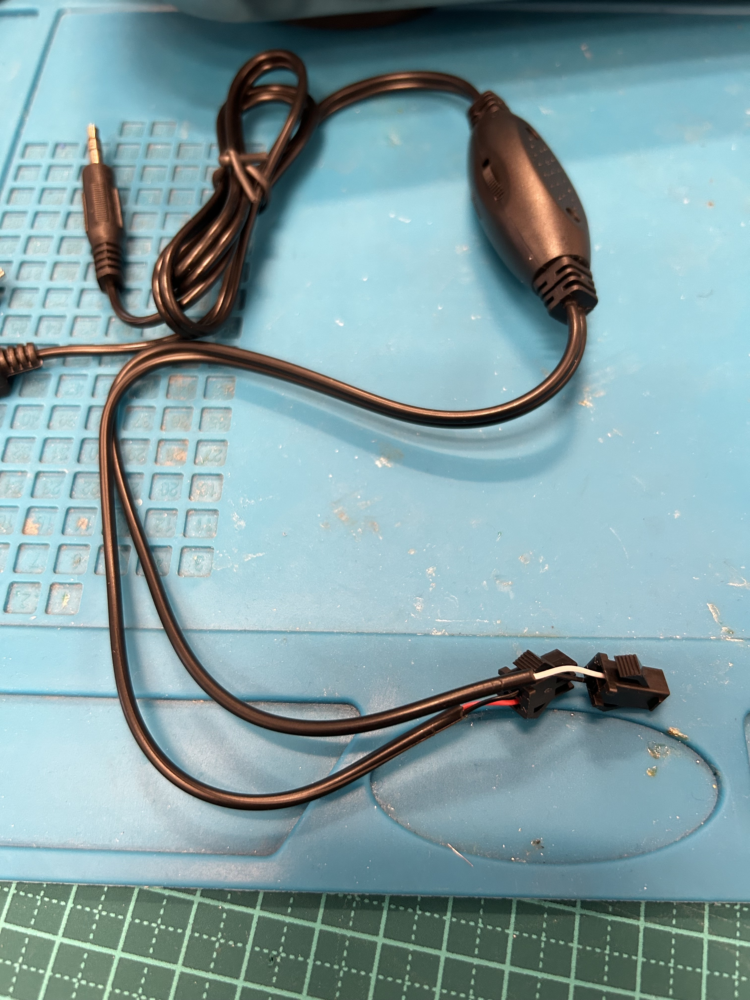
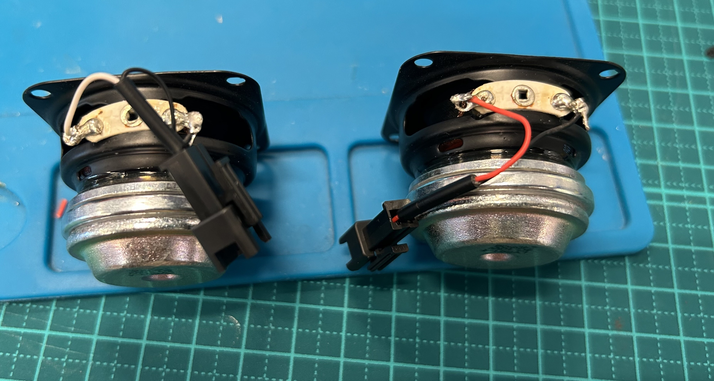
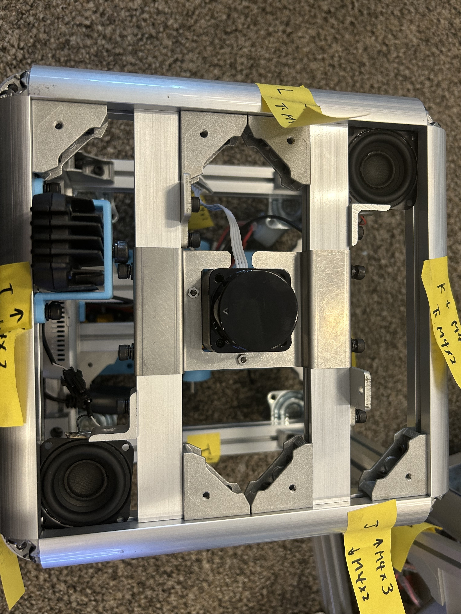
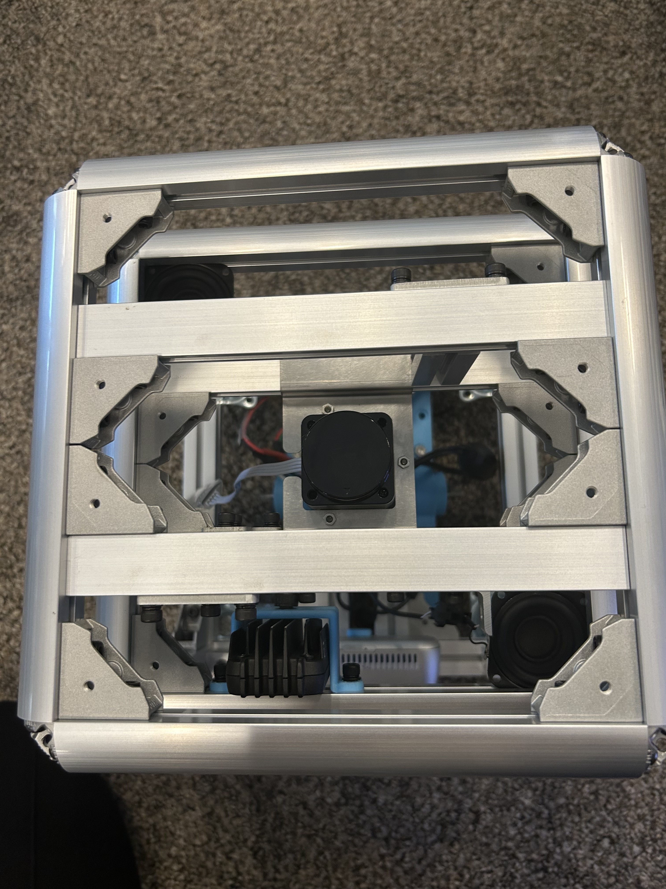

## スピーカのとりつけ

スピーカをとりつけます

---

## 必要な工具

- はんだ
- ワイヤーストリッパー
- 圧着工具
- ニッパー

---

## 部材

- speaker x2
- アンプ
- SMコネクタ 2pin 2セット

## 手順
アンプのケーブルを半分くらいにカットし、SMコネクタを取り付ける 
残りのケーブルで写真のようなケーブルを2本作成する 
片方はスピーカにはんだ付け、片方はSMコネクタをとりつける 
SMコネクタは黒色が1番になるようにする

スピーカにはんだ付けする(+が赤または白で、−が黒になるようにする)

写真のようにL字ブラケットを引っ掛けてとりつける

スピーカまでとりつけたら天板もとりつけて位置を調整しねじを固くしめる

