## Ubuntu24.04の導入

PCにLINUX OS [Ubuntu24.04](https://ubuntu.com/download/desktop)を導入します。
わからない方のみ下を見てください。

---
 
今回は1つのSSDの中にUbuntu24.04のみ(Windowsとは共存させない)を想定しています。 
**よってすでにWindowsが入っている場合は削除する作業をしています。** 
他のバージョンのUbuntuやWindowsなどを入れたい場合は別のSSDを用意することを 
おすすめします。

**Ubuntuとは**
Ubuntu（ウブンツ）は、誰でも無料で使えるLinux（リナックス）というOS（オペレーティングシステム）の一つです。 
使いやすさと安定性に定評があり、ソフトウェア開発やサーバー運用などの現場で広く使われています。 
特にプログラミングやロボット開発などでは、Ubuntuが標準環境として指定されていることも多く、初学者がLinuxを学ぶ入口としてもおすすめのOSです。 
Cube petitではUbuntu18.04, 20.04, 22.04, 24.04が対応しています。

**ver24.04について**
Ubuntu 24.04は、2024年4月にリリースされたLTS（Long Term Support：長期サポート）版です。 
LTS版は5年間の公式サポートがあり、企業や研究開発などで安心して使える安定版です。 
24.04にはロボットを動かすためのROS2 (Jazzyバージョン)が対応しています。 

---

## 必要なもの

- 利用予定のminiPC or Raspberry Pi5 & 電源
- キーボード
- マウス
- モニタ、HDMIケーブル
- LiveUSBを作成する作業用PC
- Wifi環境もしくは有線LAN

---

## 手順①Live USBの作成
Ubuntu 24.04 公式サイト: http://releases.ubuntu.com/24.04/  
 
参考： 
https://www.kkaneko.jp/tools/ubuntu/ubuntudesktop.html

---

## 手順②Bootメニューに入ってUSBを起動するように設定する
PCの画面をつけた瞬間に**Delete**か**F2**もしくは**F7**を連打する 
ここはPCによります。わからなければ型番で「型番 BIOS 」等でググってください。 

BIOS画面(シンプルでだいたい青か白い画面)に入ったらOK 
そのままPCが起動したら電源を消してもう一度やり直す。 
**Boot**メニューを探し、優先順位を**USB**に変更する 

**Save&Exit**を選択肢終了する。 

---

## 手順③Ubuntu24.04のインストール
GRUB画面にきたら「Try or Install Ubuntu」を選択
デスクトップ画面が出たら左上のアプリをクリック

英語を設定しNextをクリック0

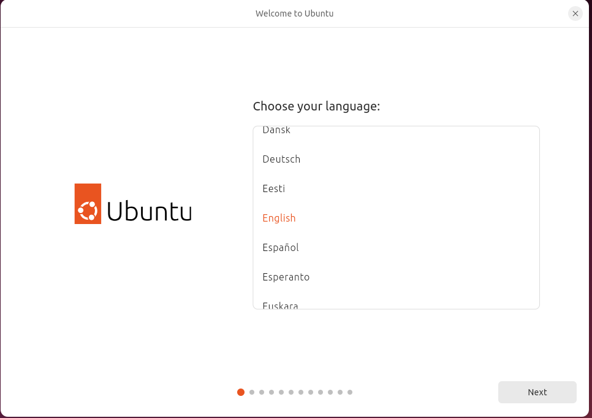

Nextをクリック
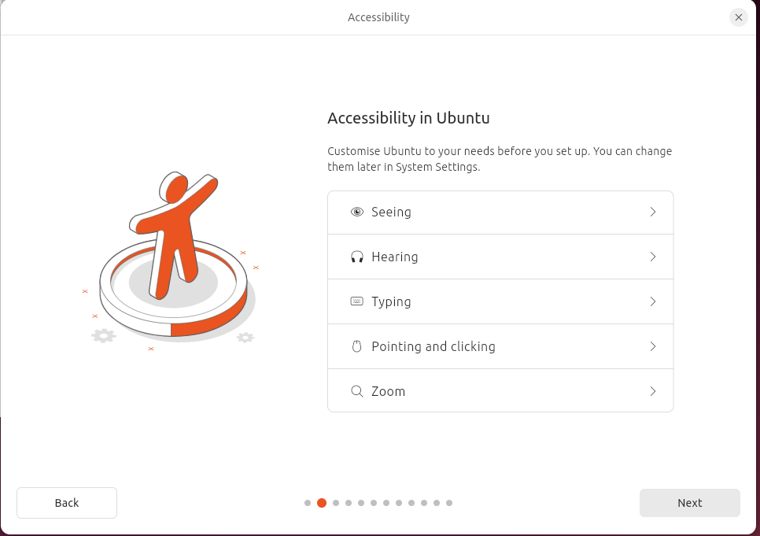
日本語配列キーボード(Enterがでかいことが多い、2キーの上が`"`)ならJapaneseを
英字配列キーボード(Enterが小さいことが多い、2キーの上が`@`)ならEnglishを選択
Nextをクリック
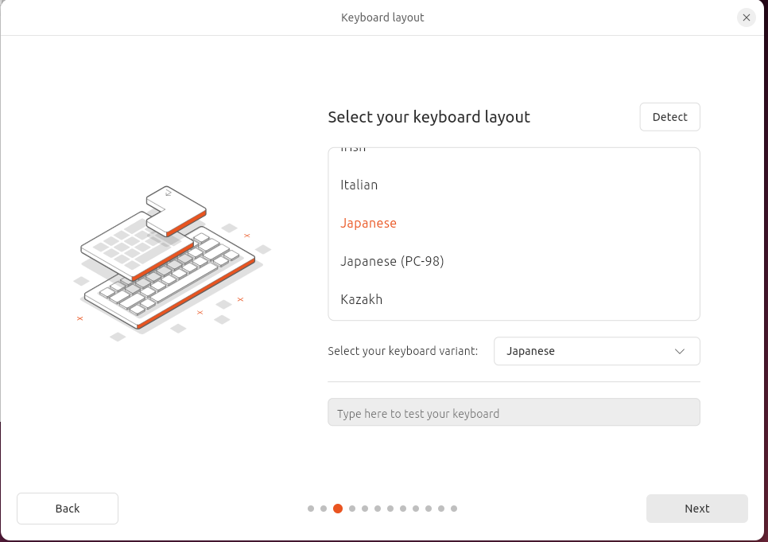
有線もしくはWifiを選択してネットワークに接続する
Nextをクリック
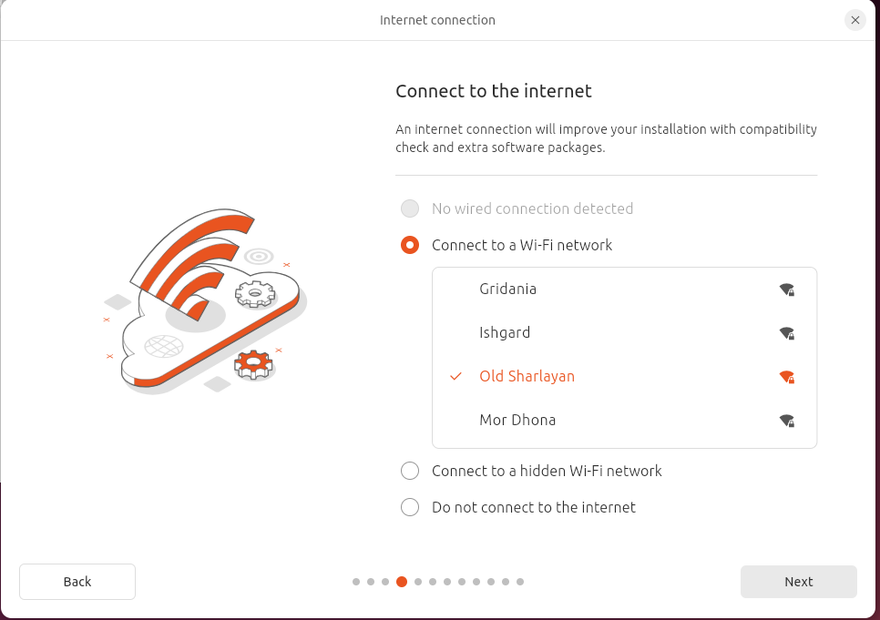
Skipをクリックする(Updateするとスタックする事例あります)

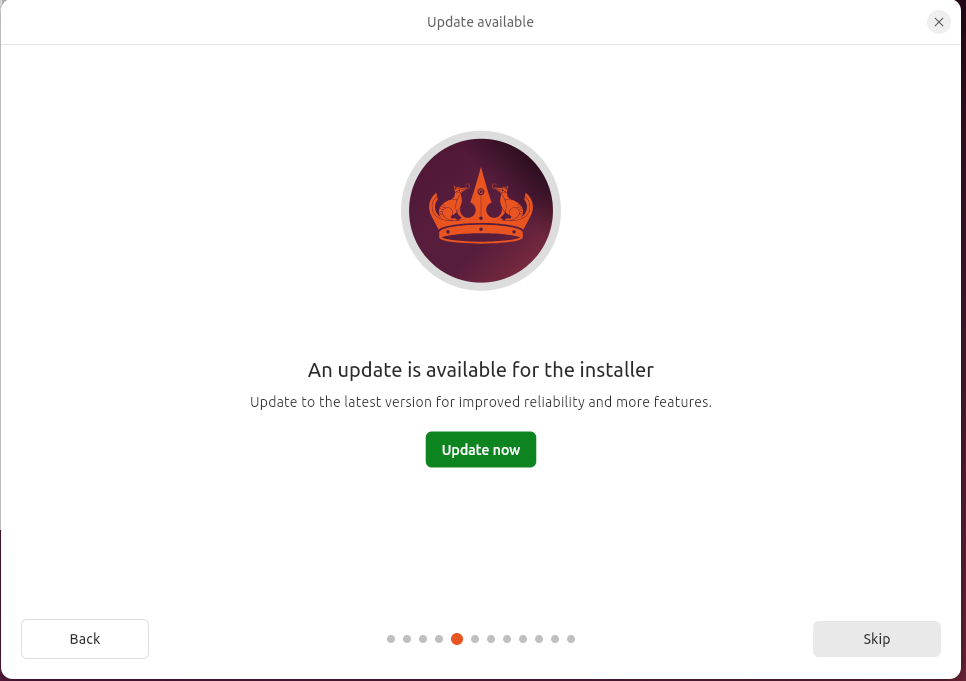

Install Ubuntuを選択してNextをクリック

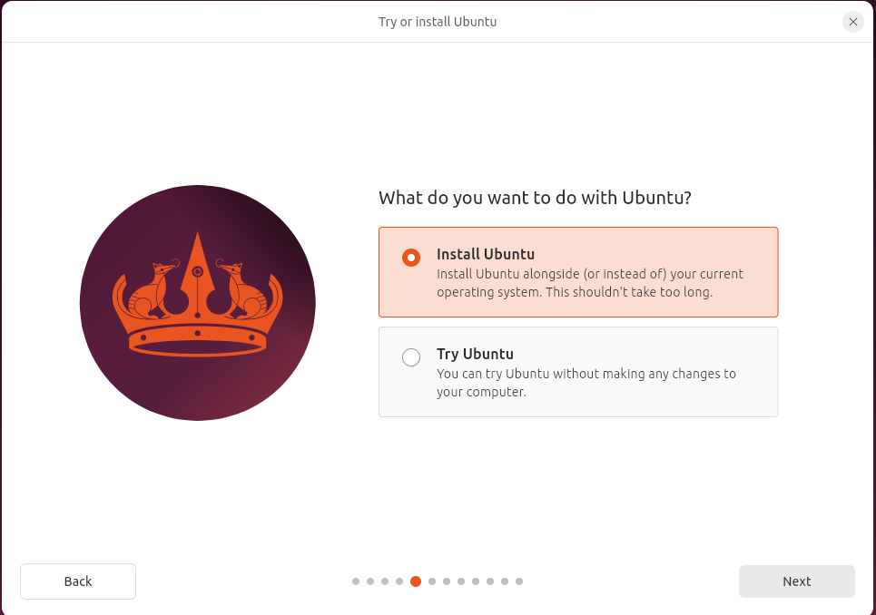
Interactive instalattionをクリック、Nextをクリック
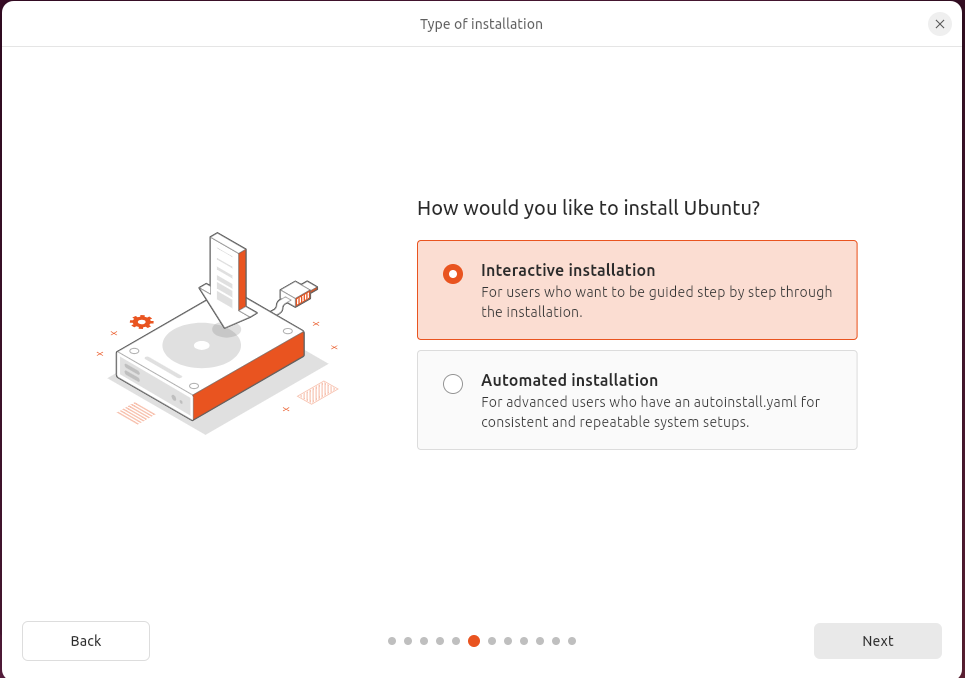
Default selectionを選択してNextをクリック
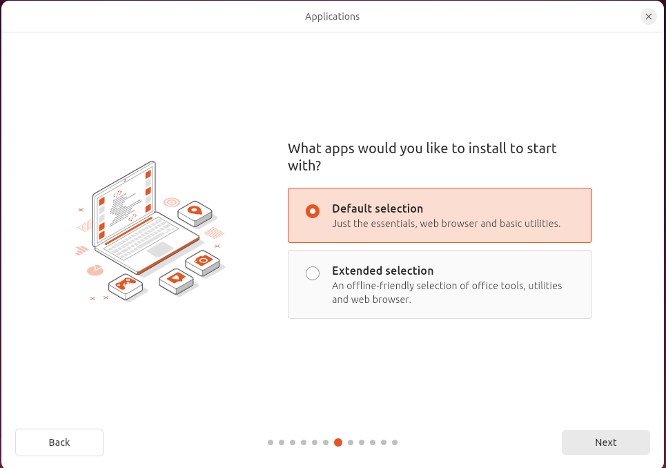
2つチェックを入れてNextをクリック
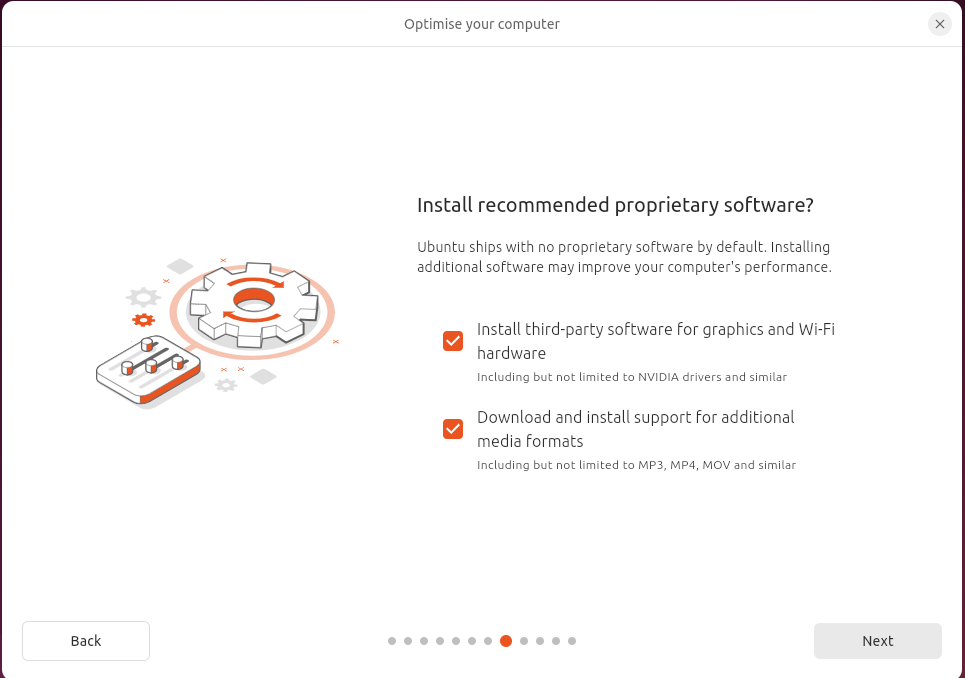
Erase disk and install Ubuntuをクリック
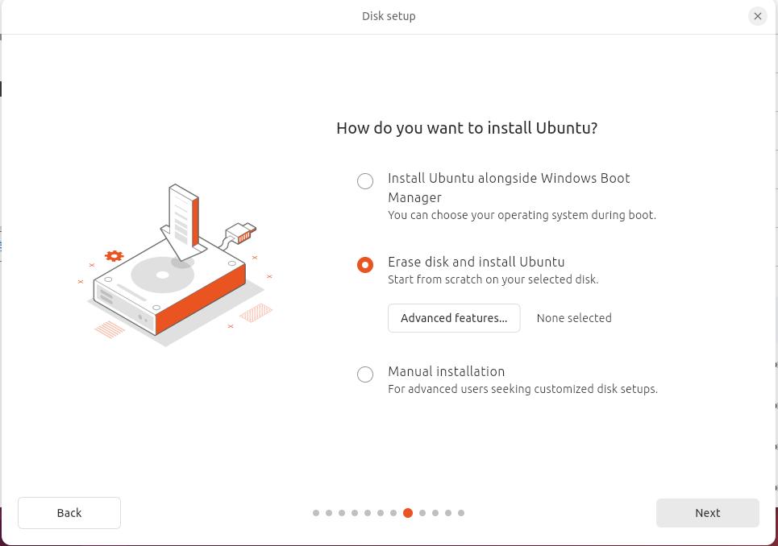
Your name：名前を入れる(cube-petit) 
Your computer name：PC名を入れる(一意であれば何でもいい、自分の名前など) 
Passworf Confirm Passwordは同じものを入れる 
 
上のチェックボックスは 
　自動ログインしたいときはチェックを入れない(ロボット機体など) 
 　毎回パスワードをうちこんで起動したい場合はチェックを入れる(自分のPCなど) 
下のチェックボックスはチェックを入れない 

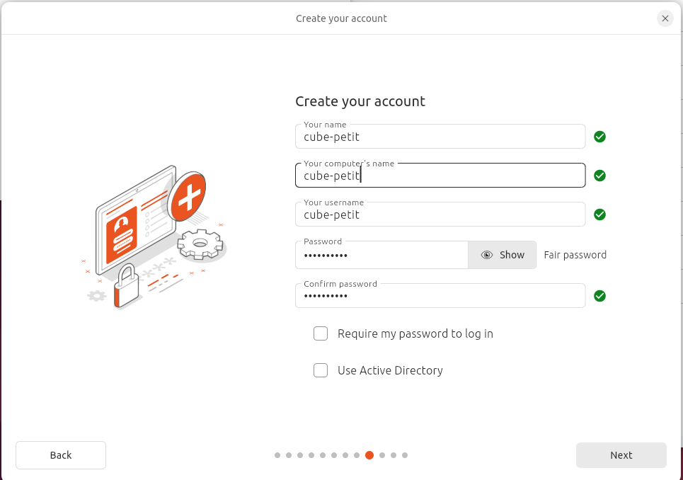
Asia/Tokyoを選択してNextをクリック
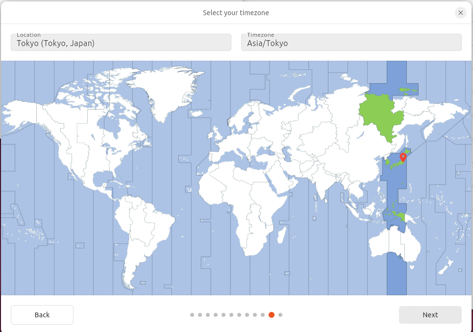
Installをクリック。数分待機する
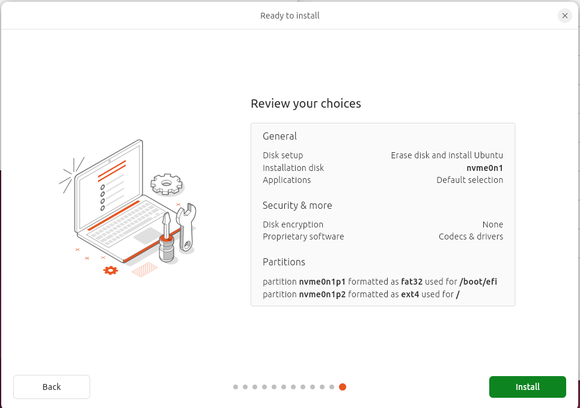
Restart Nowをクリック
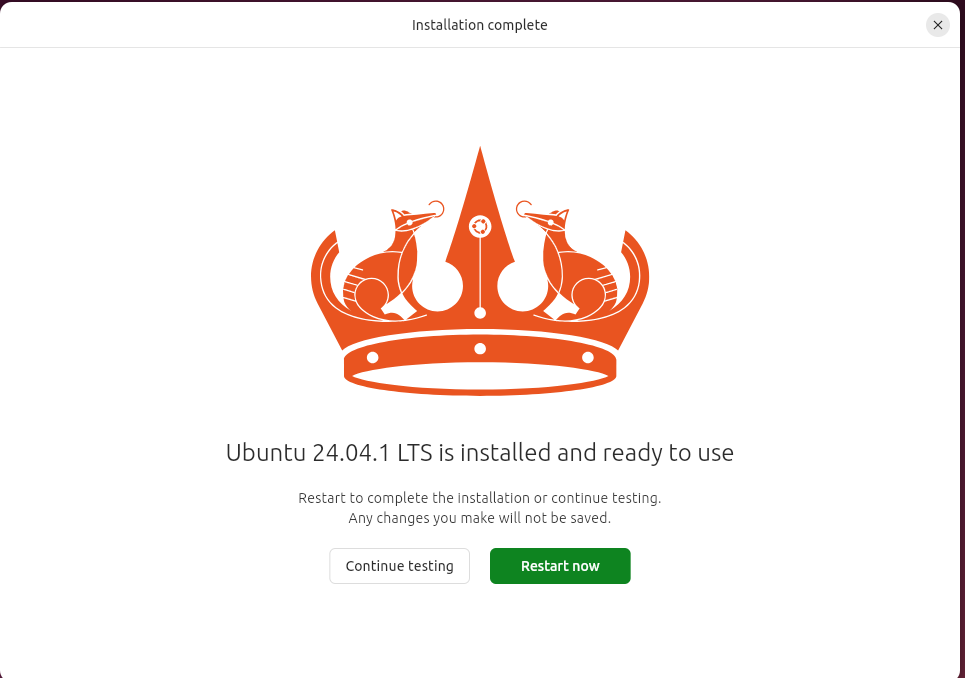

**「Please remove the installation medium, Then press Enter」**
という文字が表示されたら、USBを抜いてEnterキーを押す

## 端末(Terminal)を起動する方法
デスクトップ上で右クリック→Open in Terminal

---

[indexに戻る](../index.md)
|[PC設定に戻る](../3_pc_setting.md)
|[次のページ](./3-2_setup_pc.md)
