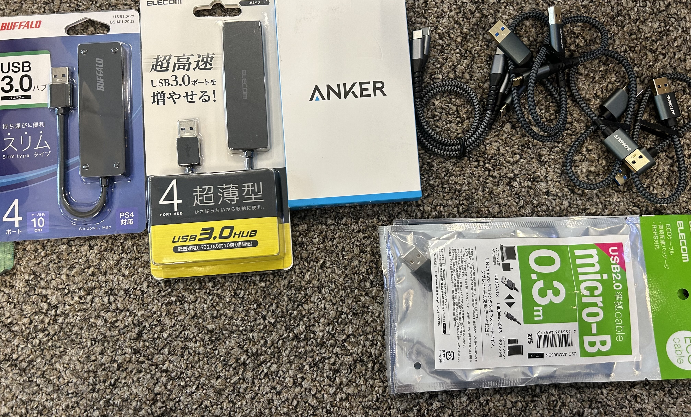
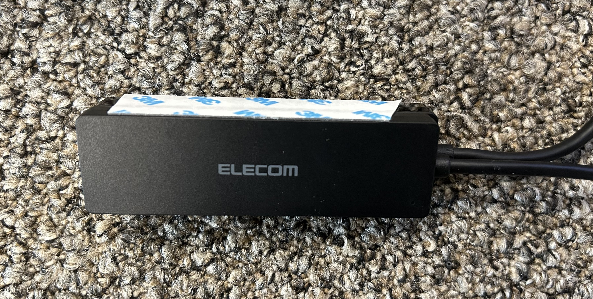
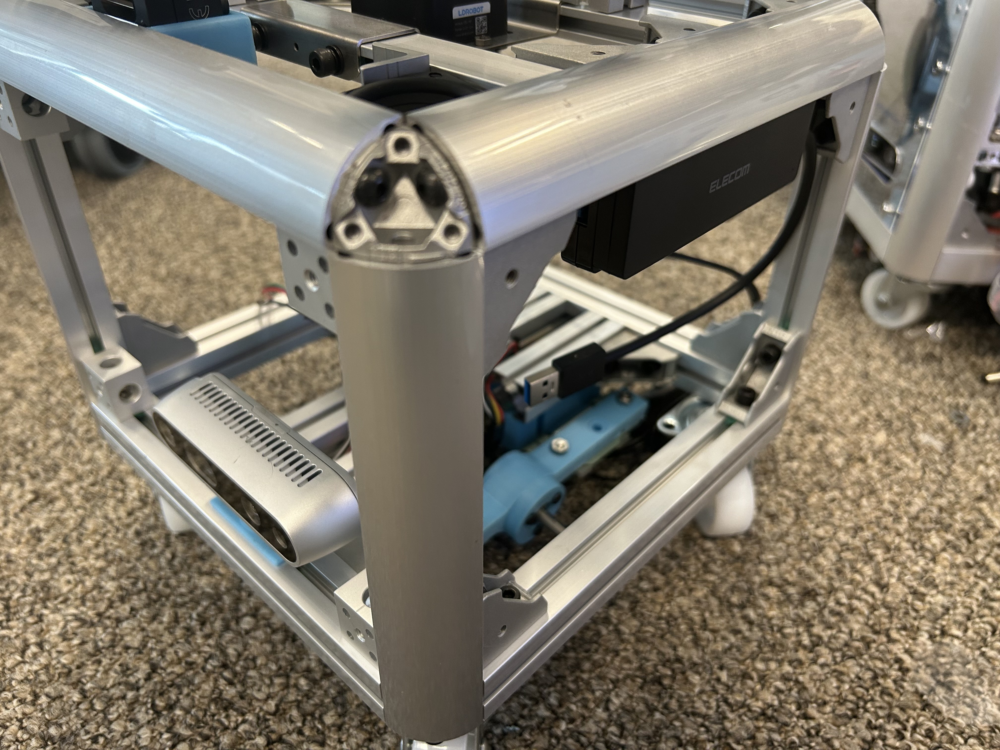
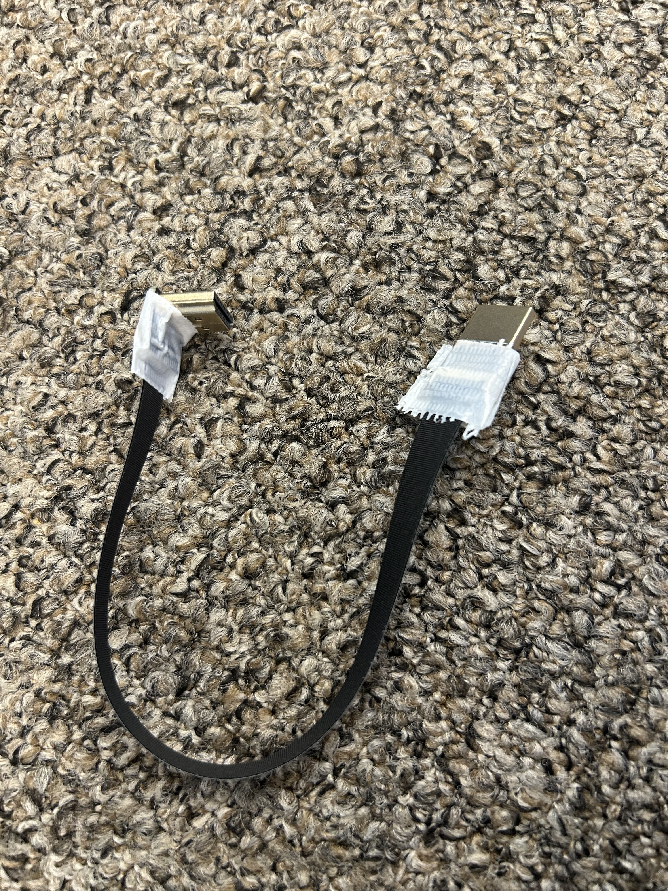

## 配線設定

cube-petit用のPCをボディに入れて、USBハブやディスプレイとケーブル接続します。

## 必要なもの
- USBハブ3個(ELECOM, BUFFARO, ANKER)
- USBケーブル
    - typeA - micro-B (0.15[m]x1本) Display電源用
    - typeA - micro B (0.3[m]x1本) LiDAR用
    - typeA - type C (0.3[m]×2本) AIカメラ、CANable(モータ)
    - typeA - type C (0.3[m]×1本) 深度カメラ用
        - (PCにC端子がついていれば)typeC - type C (0.3[m])  
    - モバイルバッテリとPCを繋ぐケーブル(PCによる)
        - DC -> DC もしくは typeC -> typeC など
- HDMIケーブル
- アイソレータ モータ用
- SoundBlaster
- キーボード用のドングル(あれば)
- PC用のモバイルバッテリ PCによる、だいたい19Vで5A程度のもの
- モータ用のモバイルバッテリ 12V DC出力のもの
- 強力両面テープ([Monotaro](https://www.monotaro.com/p/7718/0173/?t.q=3M%2019mm%20%97%BC%96%CA%83e%81%5B%83v))
- 養生など適当なテープ [Monotaro](https://www.monotaro.com/p/0845/9193/?t.q=%97%7B%90%B6%83e%81%5B%83v%81%40%94%92)

## 手順①USBハブのとりつけ
ELECOMとBUFFAROのUSBハブに図のように両面テープを取り付けてボディの側面に貼る 
ELECOMが外側に来るように貼り付ける

## 手順②USBハブ配線
PCをボディの中にいれて配線を行います

### BUFFARO
側面1port 
- microBケーブル(0.15[m]) --- ディスプレイの電源用 

下面3ポート 
- typeCケーブル(0.3[m]) --- LiDAR用 
- SoundBlaster  
- スピーカアンプ 

### ELECOM
- typeCケーブル(0.3[m]) --- AIカメラ 
- キーボードドングル 
- typeCケーブル(0.3[m]) --- 深度カメラ(PCにtypeCポートがない場合) 
- ANKERのUSBハブ(PCにUSBポートが2つしかない場合) 

### ANKER
- アイソレータ --- typeA-typeC(0.3[m]) CANablePro用 

## 手順③HDMIケーブル
HDMIケーブルは写真のようにリボンケーブルを差し込んだら養生テープなどで絶縁しておく

[indexに戻る](../index.md)
|[PC設定に戻る](../3_pc_setting.md)
|[次のページ](../../4_sensor_setting/4_sensor_setting.md)
